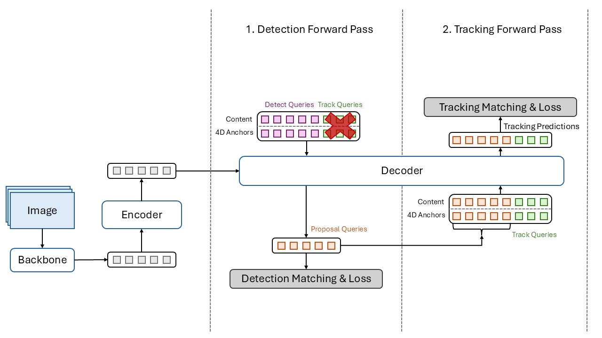

# SelfMOTR: Revisiting MOTR with Self-Generating Detection Priors

[](https://arxiv.org/abs/2511.20279)

<div align="center">
  
</div>

This README is the practical runbook for this checkout. It focuses on the scripts that are actually wired up in the repository:

- `train_*.py`: training entry points
- `eval_*.py`: run a checkpoint on a validation or held-out split and write MOT-format `*.txt` results
- `submit_*.py`: run a checkpoint on a benchmark test split and write submission files
- `util/eval_*.py`: score those result files with the vendored TrackEval wrapper

If you just want the shortest path from training to inference to evaluation, read:

1. [Setup](#setup)
2. [Expected Data Layout](#expected-data-layout)
3. [Training](#training)
4. [Inference and Submission](#inference-and-submission)
5. [Evaluation with `util/eval_*.py`](#evaluation-with-utileval_py)

## What To Ignore

The shell scripts under `configs/` are useful as historical references, but they are **not** copy-paste safe as-is:

- they hard-code machine-specific absolute paths
- several still use stale flags such as `--epoch` even though the Python scripts expect `--epochs`
- they assume a particular cluster environment

Use the commands in this README as the canonical starting point instead.

## Setup

The original notes for this repo used Python 3.10. That is the safest starting point here because of the custom CUDA op build under `models/ops`.

### 1. Create an environment

```bash
python3.10 -m venv .venv
source .venv/bin/activate
python -m pip install --upgrade pip
```

### 2. Install PyTorch and Python dependencies

Pick the PyTorch CUDA wheel that matches your machine. Example for CUDA 12.8:

```bash
pip install torch torchvision --index-url https://download.pytorch.org/whl/cu128
pip install -r requirements.txt
```

If you need a local CUDA toolkit / `nvcc` for building the extension, the optional Conda YAMLs in `conda_envs/` are for that purpose.

### 3. Build the custom Deformable Attention op

```bash
cd models/ops
python setup.py build install
cd ../..
```

If you change your PyTorch version or CUDA toolkit, rebuild this extension.

## Expected Data Layout

Set `--mot_path` to a single root directory that contains the dataset folders expected by the loaders:

```text
$DATA_ROOT/
├── DanceTrack/
│   ├── train/
│   ├── val/
│   └── test/
├── SportsMOT/
│   ├── train/
│   ├── val/
│   └── test/
├── WholeAnimalTrack/
│   ├── train/
│   └── test/
├── BFT/
│   ├── train/
│   └── test/
├── MOT17/
│   ├── images/
│   │   ├── train/
│   │   └── test/
│   └── labels_with_ids/
│       └── train/
└── crowdhuman/
    ├── images/
    │   ├── train/
    │   └── val/
    └── labels_with_ids/
        ├── train/
        └── val/
```

Notes:

- DanceTrack training reads `DanceTrack/train`; `eval_dance.py` reads `DanceTrack/val`; `submit_dance.py` reads `DanceTrack/test`.
- SportsMOT training reads `SportsMOT/train`; `eval_sportsmot.py` reads `SportsMOT/val`; `submit_sportsmot.py` reads `SportsMOT/test`.
- WholeAnimalTrack training reads `WholeAnimalTrack/train`; `eval_wat.py` reads `WholeAnimalTrack/test`.
- BFT training reads `BFT/train`; `eval_bft.py` reads `BFT/test`.
- MOT17 joint training uses the split files in `datasets/data_path/` and expects both `MOT17/...` and `crowdhuman/...` under the same `--mot_path`.

For TrackEval-based scoring you also need the appropriate seqmap file, for example:

- `DanceTrack/val_seqmap.txt`
- `SportsMOT/val_seqmap.txt`
- `WholeAnimalTrack/test_seqmap.txt`
- `BFT/test_seqmap.txt`

## Common Shell Variables

The commands below assume these variables:

```bash
source .venv/bin/activate

export DATA_ROOT=/abs/path/to/datasets
export PRETRAIN=/abs/path/to/r50_deformable_detr_plus_iterative_bbox_refinement-checkpoint.pth
export RUN_DIR=$PWD/logs/$(date +%Y%m%d_%H%M%S)
mkdir -p "$RUN_DIR"
```

For multi-GPU training, use `torchrun`. For single-GPU training, you can call the training script directly with `python ...`.

## Training

Keep the model-shape flags consistent between training and inference. In practice that means reusing the same values for:

- `--meta_arch`
- `--with_box_refine`
- `--shared_decoder` when applicable
- `--dec_layers` if you changed it
- `--query_interaction_layer`
- `--num_queries`
- `--num_queries_detect`

### DanceTrack

This is the closest thing to the repo default DanceTrack recipe in the current codebase.

```bash
torchrun --nproc_per_node=4 train_dance.py \
  --meta_arch motrv2_self \
  --dataset_file e2e_dance_v2_final \
  --epochs 20 \
  --save_period 1 \
  --with_box_refine \
  --shared_decoder \
  --lr_drop 16 \
  --lr 2e-4 \
  --lr_backbone 2e-5 \
  --pretrained "$PRETRAIN" \
  --output_dir "$RUN_DIR" \
  --batch_size 1 \
  --sample_mode random_interval \
  --sample_interval 10 \
  --sampler_lengths 4 \
  --merger_dropout 0 \
  --dropout 0 \
  --random_drop 0.1 \
  --fp_ratio 0.3 \
  --query_interaction_layer QIMv2 \
  --num_queries 10 \
  --num_queries_detect 300 \
  --mot_path "$DATA_ROOT" \
  --accum_iter 2 \
  --score_threshold 0.05 \
  --lambda_detect 0.5 \
  --append_crowd \
  --query_denoise 0.05 \
  --use_checkpoint
```

### MOT17 + CrowdHuman Joint Training

This is the MOT17 training path in the repo. The split lists already live under `datasets/data_path/`.

```bash
torchrun --nproc_per_node=8 train_mot17.py \
  --meta_arch motrv2_self \
  --dataset_file e2e_joint \
  --epochs 240 \
  --save_period 10 \
  --with_box_refine \
  --shared_decoder \
  --lr_drop_epochs 80 160 \
  --lr 2e-4 \
  --lr_backbone 2e-5 \
  --pretrained "$PRETRAIN" \
  --output_dir "$RUN_DIR" \
  --batch_size 1 \
  --sample_mode random_interval \
  --sample_interval 10 \
  --sampler_steps 20 40 \
  --sampler_lengths 2 3 4 \
  --merger_dropout 0 \
  --dropout 0 \
  --random_drop 0.1 \
  --fp_ratio 0.3 \
  --query_interaction_layer QIMv2 \
  --num_queries 10 \
  --num_queries_detect 300 \
  --mot_path "$DATA_ROOT" \
  --data_txt_path_train ./datasets/data_path/joint.train \
  --data_txt_path_val ./datasets/data_path/mot17.train \
  --accum_iter 1 \
  --score_threshold 0.05 \
  --lambda_detect 0.5 \
  --use_checkpoint
```

### SportsMOT

```bash
torchrun --nproc_per_node=4 train_sportsMOT.py \
  --meta_arch motrv2_self \
  --dataset_file e2e_sportsmot \
  --epochs 20 \
  --save_period 1 \
  --with_box_refine \
  --lr_drop 10 \
  --lr 2e-4 \
  --lr_backbone 2e-5 \
  --pretrained "$PRETRAIN" \
  --output_dir "$RUN_DIR" \
  --batch_size 1 \
  --sample_mode random_interval \
  --sample_interval 10 \
  --sampler_lengths 4 \
  --merger_dropout 0 \
  --dropout 0 \
  --random_drop 0.1 \
  --fp_ratio 0.3 \
  --query_interaction_layer QIMv2 \
  --num_queries 10 \
  --num_queries_detect 300 \
  --mot_path "$DATA_ROOT" \
  --accum_iter 2 \
  --score_threshold 0.05 \
  --lambda_detect 0.5 \
  --append_crowd \
  --query_denoise 0.05 \
  --use_checkpoint
```

If you specifically want the alternative SportsMOT dataset variant, replace `e2e_sportsmot` with `e2e_sportsmot_v2`.

### WholeAnimalTrack

```bash
torchrun --nproc_per_node=4 train_wat.py \
  --meta_arch motrv2_self \
  --dataset_file e2e_wat \
  --epochs 40 \
  --save_period 1 \
  --with_box_refine \
  --shared_decoder \
  --lr_drop_epochs 16 26 \
  --lr 2e-4 \
  --lr_backbone 2e-5 \
  --pretrained "$PRETRAIN" \
  --output_dir "$RUN_DIR" \
  --batch_size 1 \
  --sample_mode random_interval \
  --sample_interval 10 \
  --sampler_lengths 4 \
  --merger_dropout 0 \
  --dropout 0 \
  --random_drop 0.1 \
  --fp_ratio 0.3 \
  --query_interaction_layer QIMv2 \
  --num_queries 10 \
  --num_queries_detect 300 \
  --mot_path "$DATA_ROOT" \
  --accum_iter 2 \
  --score_threshold 0.05 \
  --lambda_detect 0.5 \
  --append_crowd \
  --query_denoise 0.05 \
  --use_checkpoint
```

### BFT

```bash
torchrun --nproc_per_node=1 train_bft.py \
  --meta_arch motrv2_self \
  --dataset_file e2e_bft \
  --epochs 20 \
  --save_period 1 \
  --with_box_refine \
  --lr_drop 16 \
  --lr 2e-4 \
  --lr_backbone 2e-5 \
  --pretrained "$PRETRAIN" \
  --output_dir "$RUN_DIR" \
  --batch_size 1 \
  --sample_mode random_interval \
  --sample_interval 10 \
  --sampler_lengths 5 \
  --merger_dropout 0 \
  --dropout 0 \
  --random_drop 0.1 \
  --fp_ratio 0.3 \
  --query_interaction_layer QIMv2 \
  --num_queries 10 \
  --num_queries_detect 300 \
  --mot_path "$DATA_ROOT" \
  --accum_iter 8 \
  --score_threshold 0.05 \
  --lambda_detect 0.5 \
  --append_crowd \
  --query_denoise 0.05 \
  --use_checkpoint \
  --reuse_encoder_cache
```

### What Training Produces

Training writes checkpoints under `--output_dir`, including:

- `checkpoint.pth`: latest checkpoint
- `checkpointXXXX.pth`: periodic snapshots

Use one of those for inference.

## Inference and Submission

All inference scripts write MOT-format tracking results to:

```text
--output_dir/--exp_name/*.txt
```

Set a checkpoint first:

```bash
export CKPT=/abs/path/to/checkpoint.pth
```

The inference scripts automatically recover some model settings from the checkpoint (`--with_box_refine`, `--shared_decoder`, `--dec_layers`), but you should still keep the main model flags aligned with the training run.

### DanceTrack Validation

```bash
python eval_dance.py \
  --meta_arch motrv2_self \
  --dataset_file e2e_dance_v2_final \
  --with_box_refine \
  --shared_decoder \
  --query_interaction_layer QIMv2 \
  --num_queries 10 \
  --num_queries_detect 300 \
  --mot_path "$DATA_ROOT" \
  --resume "$CKPT" \
  --output_dir "$RUN_DIR/eval_dance" \
  --exp_name tracker \
  --proposal_threshold 0.05 \
  --score_threshold 0.5 \
  --miss_tolerance 20
```

### DanceTrack Test Submission Files

```bash
python submit_dance.py \
  --meta_arch motrv2_self \
  --dataset_file e2e_dance_v2_final \
  --with_box_refine \
  --shared_decoder \
  --query_interaction_layer QIMv2 \
  --num_queries 10 \
  --num_queries_detect 300 \
  --mot_path "$DATA_ROOT" \
  --resume "$CKPT" \
  --output_dir "$RUN_DIR/submit_dance" \
  --exp_name tracker \
  --proposal_threshold 0.05 \
  --score_threshold 0.5 \
  --miss_tolerance 20
```

### SportsMOT Validation

```bash
python eval_sportsmot.py \
  --meta_arch motrv2_self \
  --dataset_file e2e_sportsmot \
  --with_box_refine \
  --query_interaction_layer QIMv2 \
  --num_queries 10 \
  --num_queries_detect 300 \
  --mot_path "$DATA_ROOT" \
  --resume "$CKPT" \
  --output_dir "$RUN_DIR/eval_sportsmot" \
  --exp_name tracker \
  --proposal_threshold 0.05 \
  --score_threshold 0.5 \
  --miss_tolerance 20
```

### SportsMOT Test Submission Files

```bash
python submit_sportsmot.py \
  --meta_arch motrv2_self \
  --dataset_file e2e_sportsmot \
  --with_box_refine \
  --query_interaction_layer QIMv2 \
  --num_queries 10 \
  --num_queries_detect 300 \
  --mot_path "$DATA_ROOT" \
  --resume "$CKPT" \
  --output_dir "$RUN_DIR/submit_sportsmot" \
  --exp_name tracker \
  --proposal_threshold 0.05 \
  --score_threshold 0.5 \
  --miss_tolerance 20
```

### WholeAnimalTrack

`eval_wat.py` runs on `WholeAnimalTrack/test`, which is the held-out split used in this repo.

```bash
python eval_wat.py \
  --meta_arch motrv2_self \
  --dataset_file e2e_wat \
  --with_box_refine \
  --shared_decoder \
  --query_interaction_layer QIMv2 \
  --num_queries 10 \
  --num_queries_detect 300 \
  --mot_path "$DATA_ROOT" \
  --resume "$CKPT" \
  --output_dir "$RUN_DIR/eval_wat" \
  --exp_name tracker \
  --proposal_threshold 0.05 \
  --score_threshold 0.5 \
  --miss_tolerance 20
```

### BFT

If the training run used `--reuse_encoder_cache`, pass it here too.

```bash
python eval_bft.py \
  --meta_arch motrv2_self \
  --dataset_file e2e_bft \
  --with_box_refine \
  --query_interaction_layer QIMv2 \
  --num_queries 10 \
  --num_queries_detect 300 \
  --mot_path "$DATA_ROOT" \
  --resume "$CKPT" \
  --output_dir "$RUN_DIR/eval_bft" \
  --exp_name tracker \
  --proposal_threshold 0.05 \
  --score_threshold 0.5 \
  --miss_tolerance 20 \
  --reuse_encoder_cache
```

### MOT17 Test Export

```bash
python submit_mot17.py \
  --meta_arch motrv2_self \
  --dataset_file e2e_joint \
  --with_box_refine \
  --shared_decoder \
  --query_interaction_layer QIMv2 \
  --num_queries 10 \
  --num_queries_detect 300 \
  --mot_path "$DATA_ROOT" \
  --resume "$CKPT" \
  --output_dir "$RUN_DIR/submit_mot17" \
  --exp_name tracker \
  --proposal_threshold 0.05 \
  --score_threshold 0.5 \
  --miss_tolerance 20
```

This script is submission-oriented. For local MOT17 scoring, use TrackEval on the generated result files in the same way as the examples below.

### Optional Sequence Sharding

The `eval_*.py` and `submit_*.py` scripts support simple sequence sharding via environment variables:

```bash
RLAUNCH_REPLICA=0 RLAUNCH_REPLICA_TOTAL=4 python eval_dance.py ...
RLAUNCH_REPLICA=1 RLAUNCH_REPLICA_TOTAL=4 python eval_dance.py ...
```

Each worker gets a disjoint slice of sequences.

## Evaluation With `util/eval_*.py`

The `util/eval_*.py` scripts are thin CLI wrappers around the vendored `util.trackeval` package. They all take the same arguments:

- `*` = b for bft
- `*` = d for dancetrack
- etc


They print:

- `IDF1`
- `HOTA`
- `MOTA`
- `ASSA`
- `DETA`
- `IDSW`

and also write the usual TrackEval outputs under `--output_folder`.


## Repo Map

- `train_dance.py`: DanceTrack training
- `train_mot17.py`: MOT17 + CrowdHuman joint training
- `train_sportsMOT.py`: SportsMOT training
- `train_wat.py`: WholeAnimalTrack training
- `train_bft.py`: BFT training
- `eval_dance.py`, `eval_sportsmot.py`, `eval_wat.py`, `eval_bft.py`: run tracking on validation / held-out splits
- `submit_dance.py`, `submit_sportsmot.py`, `submit_mot17.py`: write benchmark submission files
- `util/eval_d.py`, `util/eval_s.py`, `util/eval_w.py`, `util/eval_b.py`: TrackEval wrappers
- `datasets/data_path/`: MOT17 / CrowdHuman split files used by joint training
- `models/ops/`: custom CUDA extension that must be built before training or inference

## Known Gotchas

- Use `--epochs`, not `--epoch`.
- The custom op under `models/ops` must be rebuilt after a PyTorch or CUDA change.
- Inference scripts save results to `--output_dir/--exp_name`, so `--exp_name tracker` is the easiest convention to keep.
- `train_sportsMOT.py` treats `--resume` as weight initialization only and intentionally ignores optimizer / scheduler state.
- For BFT, keep `--reuse_encoder_cache` consistent between training and inference if you used that path.
- The split files in `datasets/data_path/` assume the directory layout shown above. If your dataset root differs, edit or regenerate those files.


